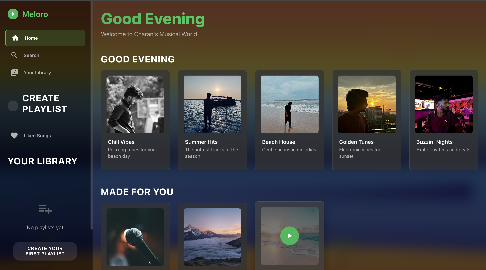

# 🎵 Meloro – A Modern Music Streaming Web App

**Meloro** is a fully responsive, sleek, and interactive Spotify-inspired music web app built with a modern tech stack. It delivers a seamless user experience for exploring, streaming, and vibing to your favorite music – anytime, anywhere.

---

## 🌟 Features

- 🎧 Stream music with a dynamic and elegant UI
- 🎨 Responsive design optimized for all devices
- 🔍 Browse playlists and trending tracks
- 💡 Clean audio player with intuitive controls
- 🏝️ Custom beach animation for a premium vibe
- 🎵 Playlist view and playback simulation
- ⚡ Smooth transitions and hover effects

---

## 🛠 Tech Stack

- **Frontend**: React.js, Redux Toolkit, React Router
- **Styling**: CSS3, Custom CSS Animations
- **Audio**: Howler.js for audio playback
- **Animations**: GSAP for smooth animations
- **Icons**: Material-UI Icons
- **State Management**: Redux Toolkit

---

## 📸 Screenshots

| Home Page | 
|-----------|
|  | 

---

## 🚀 Getting Started

### 1. Clone the Repository

```bash
git clone https://github.com/charansai2003/meloro-stream.git
cd meloro-stream
```

### 2. Install Dependencies

```bash
npm install
```

### 3. Start the Development Server

```bash
npm start
```

Open [http://localhost:3000](http://localhost:3000) to view it in your browser.

### 4. Build for Production

```bash
npm run build
```

---

## 🎯 Key Features

### 🏠 Home Page
- Personalized welcome message
- "Good Evening" playlist section
- "Made For You" recommendations
- Beautiful beach-themed animations

### 🎵 Audio Player
- Full playback controls (play, pause, skip, volume)
- Progress bar with seek functionality
- Current track information display
- Fixed bottom positioning for easy access

### 📚 Library & Search
- Browse your music library
- Search functionality for finding tracks
- Playlist management

### 🎨 Design
- Sunset beach aesthetic with animated backgrounds
- Responsive design for all screen sizes
- Smooth transitions and hover effects
- Premium UI/UX experience

---

## 🤝 Contributing

1. Fork the repository
2. Create your feature branch (`git checkout -b feature/AmazingFeature`)
3. Commit your changes (`git commit -m 'Add some AmazingFeature'`)
4. Push to the branch (`git push origin feature/AmazingFeature`)
5. Open a Pull Request

---

## 📄 License

This project is licensed under the MIT License - see the [LICENSE](LICENSE) file for details.

---

## 👨‍💻 Author

**Charan Sai** 
---

## 🙏 Acknowledgments

- Inspired by Spotify's beautiful design
- Built with modern web technologies
- Special thanks to the React and Redux communities
